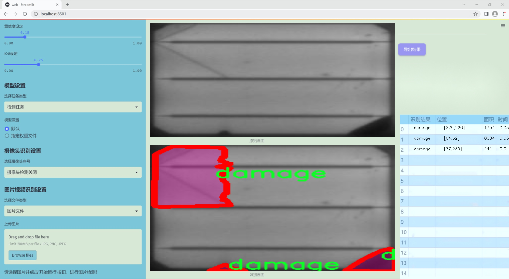
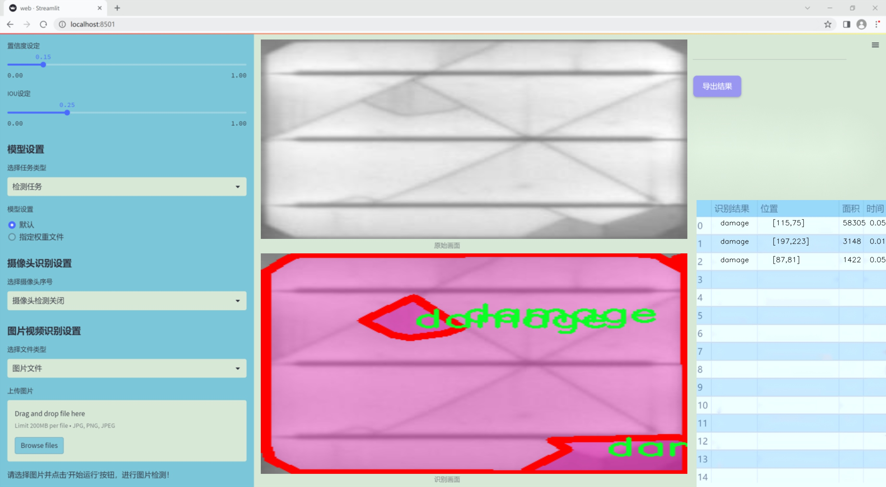
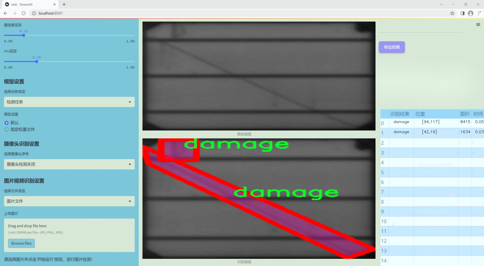
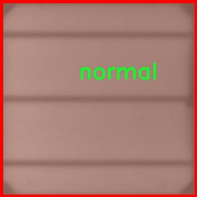
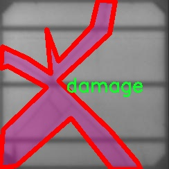
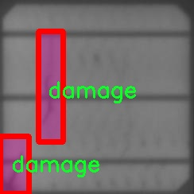
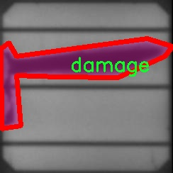
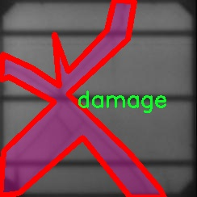

### 1.背景意义

### 研究背景与意义

随着全球对可再生能源的关注日益增强，太阳能作为一种清洁且可持续的能源形式，正受到越来越多的重视。然而，太阳能板在使用过程中可能会受到多种因素的影响，如天气变化、环境污染以及物理损伤等，这些因素可能导致太阳能板的性能下降，甚至完全失效。因此，及时有效地检测和修复太阳能板的损伤，成为保障其高效运行的重要环节。

传统的人工检测方法不仅耗时耗力，而且容易受到人为因素的影响，导致检测结果的不准确。随着计算机视觉技术的迅速发展，基于深度学习的图像分割技术为太阳能板损伤检测提供了新的解决方案。特别是YOLO（You Only Look Once）系列模型，以其高效的实时检测能力和较高的准确率，成为目标检测领域的热门选择。通过对YOLOv11模型的改进，结合实例分割技术，可以实现对太阳能板表面损伤的精确定位和分类，从而为后续的维护和修复提供可靠的数据支持。

本研究所使用的数据集包含1900张经过精心标注的图像，分为“损伤”和“正常”两类。这一数据集的构建不仅为模型的训练提供了丰富的样本，也为后续的算法优化奠定了基础。通过对图像进行预处理和增强，提升了模型的泛化能力，使其能够在不同环境下有效识别太阳能板的损伤情况。

综上所述，基于改进YOLOv11的太阳能板表面损伤检测图像分割系统，不仅具有重要的学术价值，也为实际应用提供了切实可行的解决方案。通过提高损伤检测的效率和准确性，可以有效延长太阳能板的使用寿命，降低维护成本，推动可再生能源的可持续发展。

### 2.视频效果

[2.1 视频效果](https://www.bilibili.com/video/BV1gXqzYhEnw/)

### 3.图片效果







##### [项目涉及的源码数据来源链接](https://kdocs.cn/l/cszuIiCKVNis)**

注意：本项目提供训练的数据集和训练教程,由于版本持续更新,暂不提供权重文件（best.pt）,请按照6.训练教程进行训练后实现上图演示的效果。

### 4.数据集信息

##### 4.1 本项目数据集类别数＆类别名

nc: 2
names: ['damage', 'normal']


该项目为【图像分割】数据集，请在【训练教程和Web端加载模型教程（第三步）】这一步的时候按照【图像分割】部分的教程来训练

##### 4.2 本项目数据集信息介绍

本项目数据集信息介绍

本项目所使用的数据集专注于太阳能板表面损伤的检测与图像分割，旨在改进YOLOv11模型的性能，以实现更高效的损伤识别和分类。数据集包含两大类目标，分别为“损伤”（damage）和“正常”（normal），共计两类，旨在为模型提供清晰的分类依据。这种二分类设计使得模型能够在实际应用中迅速区分太阳能板的状态，从而为后续的维护和修复工作提供重要的参考。

数据集中的图像经过精心挑选，涵盖了不同环境条件下的太阳能板表面，确保了数据的多样性和代表性。每张图像都经过标注，损伤区域被精确框定，以便于模型在训练过程中学习到不同类型损伤的特征。此外，正常状态的图像也同样重要，它们为模型提供了对比，帮助模型理解何为“正常”状态，从而提升分类的准确性。

在数据集的构建过程中，考虑到了不同类型的损伤表现，例如划痕、裂纹、污垢等，这些损伤可能会影响太阳能板的工作效率。因此，数据集不仅关注于损伤的存在与否，还强调了损伤的多样性与复杂性。通过这样的设计，模型在面对真实世界的应用场景时，能够更好地适应不同的损伤情况，提升其实际应用价值。

综上所述，本项目的数据集为改进YOLOv11的太阳能板表面损伤检测提供了坚实的基础，既包含了损伤和正常状态的清晰分类，又确保了数据的多样性与实用性，旨在推动太阳能板监测技术的发展。











### 5.全套项目环境部署视频教程（零基础手把手教学）

[5.1 所需软件PyCharm和Anaconda安装教程（第一步）](https://www.bilibili.com/video/BV1BoC1YCEKi/?spm_id_from=333.999.0.0&vd_source=bc9aec86d164b67a7004b996143742dc)


[5.2 安装Python虚拟环境创建和依赖库安装视频教程（第二步）](https://www.bilibili.com/video/BV1ZoC1YCEBw?spm_id_from=333.788.videopod.sections&vd_source=bc9aec86d164b67a7004b996143742dc)

### 6.改进YOLOv11训练教程和Web_UI前端加载模型教程（零基础手把手教学）

[6.1 改进YOLOv11训练教程和Web_UI前端加载模型教程（第三步）](https://www.bilibili.com/video/BV1BoC1YCEhR?spm_id_from=333.788.videopod.sections&vd_source=bc9aec86d164b67a7004b996143742dc)


按照上面的训练视频教程链接加载项目提供的数据集，运行train.py即可开始训练



     Epoch   gpu_mem       box       obj       cls    labels  img_size
     1/200     20.8G   0.01576   0.01955  0.007536        22      1280: 100%|██████████| 849/849 [14:42<00:00,  1.04s/it]
               Class     Images     Labels          P          R     mAP@.5 mAP@.5:.95: 100%|██████████| 213/213 [01:14<00:00,  2.87it/s]
                 all       3395      17314      0.994      0.957      0.0957      0.0843

     Epoch   gpu_mem       box       obj       cls    labels  img_size
     2/200     20.8G   0.01578   0.01923  0.007006        22      1280: 100%|██████████| 849/849 [14:44<00:00,  1.04s/it]
               Class     Images     Labels          P          R     mAP@.5 mAP@.5:.95: 100%|██████████| 213/213 [01:12<00:00,  2.95it/s]
                 all       3395      17314      0.996      0.956      0.0957      0.0845

     Epoch   gpu_mem       box       obj       cls    labels  img_size
     3/200     20.8G   0.01561    0.0191  0.006895        27      1280: 100%|██████████| 849/849 [10:56<00:00,  1.29it/s]
               Class     Images     Labels          P          R     mAP@.5 mAP@.5:.95: 100%|███████   | 187/213 [00:52<00:00,  4.04it/s]
                 all       3395      17314      0.996      0.957      0.0957      0.0845


###### [项目数据集下载链接](https://kdocs.cn/l/cszuIiCKVNis)

### 7.原始YOLOv11算法讲解

YOLOv11是Ultralytics推出的YOLO系列最新版本，专为实现尖端的物体检测而设计。其架构和训练方法上进行了重大改进，使之不仅具备卓越的准确性和处理速度，还在计算效率上实现了一场革命。得益于其改进的主干和颈部架构，YOLOv11在特征提取和处理复杂任务时表现更加出色。在2024年9月27日，Ultralytics通过长达九小时的在线直播发布这一新作，展示了其在计算机视觉领域的革新。

YOLOv11通过精细的架构设计和优化训练流程，在保持高精度的同时，缩减了参数量，与YOLOv8m相比减少了22%的参数，使其在COCO数据集上的平均准确度（mAP）有所提升。这种效率的提高使YOLOv11非常适合部署在各种硬件环境中，包括边缘设备、云计算平台以及支持NVIDIA GPU的系统，确保在灵活性上的优势。

该模型支持广泛的任务，从对象检测、实例分割到图像分类、姿态估计和定向对象检测（OBB），几乎覆盖了计算机视觉的所有主要挑战。其创新的C3k2和C2PSA模块提升了网络深度和注意力机制的应用，提高了特征提取的效率和效果。同时，YOLOv11的改进网络结构也使之在复杂视觉任务上得以从容应对，成为各类计算机视觉任务的多功能选择。这些特性令YOLOv11在实施实时物体检测的各个领域中表现出众。
* * *

2024年9月27日，Ultralytics在线直播长达九小时，为YOLO11召开“发布会”

YOLO11 是 Ultralytics YOLO 系列实时物体检测器的最新版本，它以尖端的准确性、速度和效率重新定义了可能性。在之前 YOLO
版本的显著进步的基础上，YOLO11 在架构和训练方法方面进行了重大改进，使其成为各种计算机视觉任务的多功能选择。


##### YOLO11主要特点：

  * 增强的特征提取：YOLO11 采用了改进的主干和颈部架构，增强了特征提取能力，可实现更精确的对象检测和复杂任务性能。
  * 针对效率和速度进行了优化：YOLO11 引入了完善的架构设计和优化的训练流程，可提供更快的处理速度，并在准确度和性能之间保持最佳平衡。
  * 更少的参数，更高的准确度：借助模型设计的进步，YOLO11m 在 COCO 数据集上实现了更高的平均准确度 (mAP)，同时使用的参数比 YOLOv8m 少 22%，从而提高了计算效率，同时又不影响准确度。
  * 跨环境的适应性：YOLO11 可以无缝部署在各种环境中，包括边缘设备、云平台和支持 NVIDIA GPU 的系统，从而确保最大的灵活性。
  * 支持的任务范围广泛：无论是对象检测、实例分割、图像分类、姿势估计还是定向对象检测 (OBB)，YOLO11 都旨在满足各种计算机视觉挑战。

##### 支持的任务和模式

YOLO11 以 YOLOv8 中引入的多功能模型系列为基础，为各种计算机视觉任务提供增强的支持：

Model| Filenames| Task| Inference| Validation| Training| Export  
---|---|---|---|---|---|---  
YOLO11| yolol11n.pt, yolol11s.pt, yolol11m.pt, yolol11x.pt| Detection| ✅| ✅|
✅| ✅  
YOLO11-seg| yolol11n-seg.pt, yolol11s-seg.pt, yolol11m-seg.pt,
yolol11x-seg.pt| Instance Segmentation| ✅| ✅| ✅| ✅  
YOLO11-pose| yolol11n-pose.pt, yolol11s-pose.pt, yolol11m-pose.pt,
yolol11x-pose.pt| Pose/Keypoints| ✅| ✅| ✅| ✅  
YOLO11-obb| yolol11n-obb.pt, yolol11s-obb.pt, yolol11m-obb.pt,
yolol11x-obb.pt| Oriented Detection| ✅| ✅| ✅| ✅  
YOLO11-cls| yolol11n-cls.pt, yolol11s-cls.pt, yolol11m-cls.pt,
yolol11x-cls.pt| Classification| ✅| ✅| ✅| ✅  
  
##### 简单的 YOLO11 训练和推理示例

以下示例适用于用于对象检测的 YOLO11 Detect 模型。

    
    
    from ultralytics import YOLO
    
    # Load a model
    model = YOLO("yolo11n.pt")
    
    # Train the model
    train_results = model.train(
        data="coco8.yaml",  # path to dataset YAML
        epochs=100,  # number of training epochs
        imgsz=640,  # training image size
        device="cpu",  # device to run on, i.e. device=0 or device=0,1,2,3 or device=cpu
    )
    
    # Evaluate model performance on the validation set
    metrics = model.val()
    
    # Perform object detection on an image
    results = model("path/to/image.jpg")
    results[0].show()
    
    # Export the model to ONNX format
    path = model.export(format="onnx")  # return path to exported model

##### 支持部署于边缘设备

YOLO11 专为适应各种环境而设计，包括边缘设备。其优化的架构和高效的处理能力使其适合部署在边缘设备、云平台和支持 NVIDIA GPU
的系统上。这种灵活性确保 YOLO11 可用于各种应用，从移动设备上的实时检测到云环境中的复杂分割任务。有关部署选项的更多详细信息，请参阅导出文档。

##### YOLOv11 yaml文件

    
    
    # Ultralytics YOLO 🚀, AGPL-3.0 license
    # YOLO11 object detection model with P3-P5 outputs. For Usage examples see https://docs.ultralytics.com/tasks/detect
    
    # Parameters
    nc: 80 # number of classes
    scales: # model compound scaling constants, i.e. 'model=yolo11n.yaml' will call yolo11.yaml with scale 'n'
      # [depth, width, max_channels]
      n: [0.50, 0.25, 1024] # summary: 319 layers, 2624080 parameters, 2624064 gradients, 6.6 GFLOPs
      s: [0.50, 0.50, 1024] # summary: 319 layers, 9458752 parameters, 9458736 gradients, 21.7 GFLOPs
      m: [0.50, 1.00, 512] # summary: 409 layers, 20114688 parameters, 20114672 gradients, 68.5 GFLOPs
      l: [1.00, 1.00, 512] # summary: 631 layers, 25372160 parameters, 25372144 gradients, 87.6 GFLOPs
      x: [1.00, 1.50, 512] # summary: 631 layers, 56966176 parameters, 56966160 gradients, 196.0 GFLOPs
    
    # YOLO11n backbone
    backbone:
      # [from, repeats, module, args]
      - [-1, 1, Conv, [64, 3, 2]] # 0-P1/2
      - [-1, 1, Conv, [128, 3, 2]] # 1-P2/4
      - [-1, 2, C3k2, [256, False, 0.25]]
      - [-1, 1, Conv, [256, 3, 2]] # 3-P3/8
      - [-1, 2, C3k2, [512, False, 0.25]]
      - [-1, 1, Conv, [512, 3, 2]] # 5-P4/16
      - [-1, 2, C3k2, [512, True]]
      - [-1, 1, Conv, [1024, 3, 2]] # 7-P5/32
      - [-1, 2, C3k2, [1024, True]]
      - [-1, 1, SPPF, [1024, 5]] # 9
      - [-1, 2, C2PSA, [1024]] # 10
    
    # YOLO11n head
    head:
      - [-1, 1, nn.Upsample, [None, 2, "nearest"]]
      - [[-1, 6], 1, Concat, [1]] # cat backbone P4
      - [-1, 2, C3k2, [512, False]] # 13
    
      - [-1, 1, nn.Upsample, [None, 2, "nearest"]]
      - [[-1, 4], 1, Concat, [1]] # cat backbone P3
      - [-1, 2, C3k2, [256, False]] # 16 (P3/8-small)
    
      - [-1, 1, Conv, [256, 3, 2]]
      - [[-1, 13], 1, Concat, [1]] # cat head P4
      - [-1, 2, C3k2, [512, False]] # 19 (P4/16-medium)
    
      - [-1, 1, Conv, [512, 3, 2]]
      - [[-1, 10], 1, Concat, [1]] # cat head P5
      - [-1, 2, C3k2, [1024, True]] # 22 (P5/32-large)
    
      - [[16, 19, 22], 1, Detect, [nc]] # Detect(P3, P4, P5)
    

**YOLO11和YOLOv8 yaml文件的区别**


##### 改进模块代码

  * C3k2 

    
    
    class C3k2(C2f):
        """Faster Implementation of CSP Bottleneck with 2 convolutions."""
    
        def __init__(self, c1, c2, n=1, c3k=False, e=0.5, g=1, shortcut=True):
            """Initializes the C3k2 module, a faster CSP Bottleneck with 2 convolutions and optional C3k blocks."""
            super().__init__(c1, c2, n, shortcut, g, e)
            self.m = nn.ModuleList(
                C3k(self.c, self.c, 2, shortcut, g) if c3k else Bottleneck(self.c, self.c, shortcut, g) for _ in range(n)
            )

C3k2，它是具有两个卷积的CSP（Partial Cross Stage）瓶颈架构的更快实现。

**类继承：**

  * `C3k2`继承自类`C2f`。这表明`C2f`很可能实现了经过修改的基本CSP结构，而`C3k2`进一步优化或修改了此结构。

**构造函数（`__init__`）：**

  * `c1`：输入通道。

  * `c2`：输出通道。

  * `n`：瓶颈层数（默认为1）。

  * `c3k`：一个布尔标志，确定是否使用`C3k`块或常规`Bottleneck`块。

  * `e`：扩展比率，控制隐藏层的宽度（默认为0.5）。

  * `g`：分组卷积的组归一化参数或组数（默认值为 1）。

  * `shortcut`：一个布尔值，用于确定是否在网络中包含快捷方式连接（默认值为 `True`）。

**初始化：**

  * `super().__init__(c1, c2, n, short-cut, g, e)` 调用父类 `C2f` 的构造函数，初始化标准 CSP 组件，如通道数、快捷方式、组等。

**模块列表（`self.m`）：**

  * `nn.ModuleList` 存储 `C3k` 或 `Bottleneck` 模块，具体取决于 `c3k` 的值。

  * 如果 `c3k` 为 `True`，它会初始化 `C3k` 模块。`C3k` 模块接收以下参数：

  * `self.c`：通道数（源自 `C2f`）。

  * `2`：这表示在 `C3k` 块内使用了两个卷积层。

  * `shortcut` 和 `g`：从 `C3k2` 构造函数传递。

  * 如果 `c3k` 为 `False`，则初始化标准 `Bottleneck` 模块。

`for _ in range(n)` 表示将创建 `n` 个这样的块。

**总结：**

  * `C3k2` 实现了 CSP 瓶颈架构，可以选择使用自定义 `C3k` 块（具有两个卷积）或标准 `Bottleneck` 块，具体取决于 `c3k` 标志。

  * C2PSA

    
    
    class C2PSA(nn.Module):
        """
        C2PSA module with attention mechanism for enhanced feature extraction and processing.
    
        This module implements a convolutional block with attention mechanisms to enhance feature extraction and processing
        capabilities. It includes a series of PSABlock modules for self-attention and feed-forward operations.
    
        Attributes:
            c (int): Number of hidden channels.
            cv1 (Conv): 1x1 convolution layer to reduce the number of input channels to 2*c.
            cv2 (Conv): 1x1 convolution layer to reduce the number of output channels to c.
            m (nn.Sequential): Sequential container of PSABlock modules for attention and feed-forward operations.
    
        Methods:
            forward: Performs a forward pass through the C2PSA module, applying attention and feed-forward operations.
    
        Notes:
            This module essentially is the same as PSA module, but refactored to allow stacking more PSABlock modules.
    
        Examples:
            >>> c2psa = C2PSA(c1=256, c2=256, n=3, e=0.5)
            >>> input_tensor = torch.randn(1, 256, 64, 64)
            >>> output_tensor = c2psa(input_tensor)
        """
    
        def __init__(self, c1, c2, n=1, e=0.5):
            """Initializes the C2PSA module with specified input/output channels, number of layers, and expansion ratio."""
            super().__init__()
            assert c1 == c2
            self.c = int(c1 * e)
            self.cv1 = Conv(c1, 2 * self.c, 1, 1)
            self.cv2 = Conv(2 * self.c, c1, 1)
    
            self.m = nn.Sequential(*(PSABlock(self.c, attn_ratio=0.5, num_heads=self.c // 64) for _ in range(n)))
    
        def forward(self, x):
            """Processes the input tensor 'x' through a series of PSA blocks and returns the transformed tensor."""
            a, b = self.cv1(x).split((self.c, self.c), dim=1)
            b = self.m(b)
            return self.cv2(torch.cat((a, b), 1))

`C2PSA` 模块是一个自定义神经网络层，带有注意力机制，用于增强特征提取和处理。

**类概述**

  * **目的：**

  * `C2PSA` 模块引入了一个卷积块，利用注意力机制来改进特征提取和处理。

  * 它使用一系列 `PSABlock` 模块，这些模块可能代表某种形式的位置自注意力 (PSA)，并且该架构旨在允许堆叠多个 `PSABlock` 层。

**构造函数（`__init__`）：**

  * **参数：**

  * `c1`：输入通道（必须等于 `c2`）。

  * `c2`：输出通道（必须等于 `c1`）。

  * `n`：要堆叠的 `PSABlock` 模块数量（默认值为 1）。

  * `e`：扩展比率，用于计算隐藏通道的数量（默认值为 0.5）。

  * **属性：**

  * `self.c`：隐藏通道数，计算为 `int(c1 * e)`。

  * `self.cv1`：一个 `1x1` 卷积，将输入通道数从 `c1` 减少到 `2 * self.c`。这为将输入分成两部分做好准备。

  * `self.cv2`：另一个 `1x1` 卷积，处理后将通道维度恢复回 `c1`。

  * `self.m`：一系列 `PSABlock` 模块。每个 `PSABlock` 接收 `self.c` 通道，注意头的数量为 `self.c // 64`。每个块应用注意和前馈操作。

**前向方法：**

  * **输入：**

  * `x`，输入张量。

  * **操作：**

  1. `self.cv1(x)` 应用 `1x1` 卷积，将输入通道大小从 `c1` 减小到 `2 * self.c`。

  2. 生成的张量沿通道维度分为两部分，`a` 和 `b`。

  * `a`：第一个 `self.c` 通道。

  * `b`：剩余的 `self.c` 通道。

  1. `b` 通过顺序容器 `self.m`，它是 `PSABlock` 模块的堆栈。这部分经过基于注意的处理。

  2. 处理后的张量 `b` 与 `a` 连接。

  3. `self.cv2` 应用 `1x1` 卷积，将通道大小恢复为 `c1`。

  * **输出：**

  * 应用注意和卷积操作后的变换后的张量。

**总结：**

  * **C2PSA** 是一个增强型卷积模块，它通过堆叠的 `PSABlock` 模块应用位置自注意力。它拆分输入张量，将注意力应用于其中一部分，然后重新组合并通过最终卷积对其进行处理。此结构有助于从输入数据中提取复杂特征。

##### 网络结构


### 8.200+种全套改进YOLOV11创新点原理讲解

#### 8.1 200+种全套改进YOLOV11创新点原理讲解大全

由于篇幅限制，每个创新点的具体原理讲解就不全部展开，具体见下列网址中的改进模块对应项目的技术原理博客网址【Blog】（创新点均为模块化搭建，原理适配YOLOv5~YOLOv11等各种版本）

[改进模块技术原理博客【Blog】网址链接](https://gitee.com/qunmasj/good)


#### 8.2 精选部分改进YOLOV11创新点原理讲解

###### 这里节选部分改进创新点展开原理讲解(完整的改进原理见上图和[改进模块技术原理博客链接](https://gitee.com/qunmasj/good)【如果此小节的图加载失败可以通过CSDN或者Github搜索该博客的标题访问原始博客，原始博客图片显示正常】


### 感受野注意力卷积（RFAConv)
#### 标准卷积操作回顾
标准的卷积操作是构造卷积神经网络的基本构件。它利用具有共享参数的滑动窗口提取特征信息，克服了全连通层构造神经网络固有的参数多、计算开销大的问题。设 X R∈C×H×W
表示输入特征图，其中C、H、W分别表示特征图的通道数、高度、宽度。为了清楚地演示卷积核的特征提取过程，我们使用 C = 1 的例子。从每个接受域滑块中提取特征信息的卷积运算可以表示为:


这里，Fi 表示计算后每个卷积滑块得到的值，Xi 表示每个滑块内对应位置的像素值，K表示卷积核，S表示卷积核中的参数个数，N表示接收域滑块的总数。可以看出，每个滑块内相同位置的 feature共享相同的参数Ki。因此，标准的卷积运算并不能捕捉到不同位置所带来的信息差异，这最终在一定程度上限制了卷积神经网络的性能。 

#### 空间注意力回顾
目前，空间注意机制是利用学习得到的注意图来突出每个特征的重要性。与前一节类似，这里以 C=1为例。突出关键特征的空间注意机制可以简单表述为:这里，Fi 表示加权运算后得到的值。xi 和Ai 表示输入特征图和学习到的注意图在不同位置的值，N为输入特征图的高和宽的乘积，表示像素值的总数。


#### 空间注意与标准卷积运算
将注意力机制整合到卷积神经网络中，可以提高卷积神经网络的性能。通过对标准卷积运算和现有空间注意机制的研究，我们认为空间注意机制有效地克服了卷积神经网络固有的参数共享的局限性。目前卷积神经网络中最常用的核大小是 1 × 1和3 × 3。在引入空间注意机制后，提取特征的卷积操作可以是 1 × 1或3 × 3卷积操作。为了直观地展示这个过程，在 1 × 1卷积运算的前面插入了空间注意机制。通过注意图对输入特征图(Re-weight“×”)进行加权运算，最后通过 1 × 1卷积运算提取接收域的滑块特征信息。整个过程可以简单地表示如下:


 这里卷积核K仅代表一个参数值。如果取A i× ki 的值作为一种新的卷积核参数，有趣的是它解决了 1×1卷积运算提取特征时的参数共享问题。然而，关于空间注意机制的传说到此结束。当空间注意机制被插入到3×3卷积运算前面时。具体情况如下:


如上所述，如果取A的值 i × ki (4)式作为一种新的卷积核参数，完全解决了大规模卷积核的参数共享问题。然而，最重要的一点是，卷积核在提取每个接受域滑块的特征时，会共享一些特征。换句话说，每个接收域滑块内都有一个重叠。仔细分析后会发现A12= a21， a13 = a22， a15 = a24……，在这种情况下，每个滑动窗口共享空间注意力地图的权重。因此，空间注意机制没有考虑整个接受域的空间特征，不能有效地解决大规模卷积核的参数共享问题。因此，空间注意机制的有效性受到限制。 

#### 创新空间注意力和标准卷积操作
该博客提出解决了现有空间注意机制的局限性，为空间处理提供了一种创新的解决方案。受RFA的启发，一系列空间注意机制被开发出来，可以进一步提高卷积神经网络的性能。RFA可以看作是一个轻量级即插即用模块，RFA设计的卷积运算(RFAConv)可以代替标准卷积来提高卷积神经网络的性能。因此，我们预测空间注意机制与标准卷积运算的结合将继续发展，并在未来带来新的突破。
接受域空间特征:为了更好地理解接受域空间特征的概念，我们将提供相关的定义。接收域空间特征是专门为卷积核设计的，并根据核大小动态生成。如图1所示，以3×3卷积核为例。在图1中，“Spatial Feature”指的是原始的Feature map。“接受域空间特征”是空间特征变换后的特征图。

 

由不重叠的滑动窗口组成。当使用 3×3卷积内核提取特征时，接收域空间特征中的每个 3×3大小窗口代表一个接收域滑块。接受域注意卷积(RFAConv):针对接受域的空间特征，我们提出了接受域注意卷积(RFA)。该方法不仅强调了接收域滑块内不同特征的重要性，而且对接收域空间特征进行了优先排序。通过该方法，完全解决了卷积核参数共享的问题。接受域空间特征是根据卷积核的大小动态生成的，因此，RFA是卷积的固定组合，不能与卷积操作的帮助分离，卷积操作同时依赖于RFA来提高性能，因此我们提出了接受场注意卷积(RFAConv)。具有3×3大小的卷积核的RFAConv整体结构如图所示。


目前，最广泛使用的接受域特征提取方法是缓慢的。经过大量的研究，我们开发了一种快速的方法，用分组卷积来代替原来的方法。具体来说，我们利用相应大小的分组卷积来动态生成基于接受域大小的展开特征。尽管与原始的无参数方法(如PyTorch提供的nn.())相比，该方法增加了一些参数，但它的速度要快得多。注意:如前一节所述，当使用 3×3卷积内核提取特征时，接收域空间特征中的每个 3×3大小窗口表示一个接收域滑块。而利用快速分组卷积提取感受野特征后，将原始特征映射为新的特征。最近的研究表明。交互信息可以提高网络性能，如[40,41,42]所示。同样，对于RFAConv来说，通过交互接受域特征信息来学习注意图可以提高网络性能。然而，与每个接收域特征交互会导致额外的计算开销，因此为了最小化计算开销和参数的数量，我们使用AvgPool来聚合每个接收域特征的全局信息。然后，使用 1×1 组卷积操作进行信息交互。最后，我们使用softmax来强调每个特征在接受域特征中的重要性。一般情况下，RFA的计算可以表示为:


这里gi×i 表示一个大小为 i×i的分组卷积，k表示卷积核的大小，Norm表示归一化，X表示输入的特征图，F由注意图 a相乘得到 rf 与转换后的接受域空间特征 Frf。与CBAM和CA不同，RFA能够为每个接受域特征生成注意图。卷积神经网络的性能受到标准卷积操作的限制，因为卷积操作依赖于共享参数，对位置变化带来的信息差异不敏感。然而，RFAConv通过强调接收域滑块中不同特征的重要性，并对接收域空间特征进行优先级排序，可以完全解决这个问题。通过RFA得到的feature map是接受域空间特征，在“Adjust Shape”后没有重叠。因此，学习到的注意图将每个接受域滑块的特征信息聚合起来。换句话说，注意力地图不再共享在每个接受域滑块。这完全弥补了现有 CA和CBAM注意机制的不足。RFA为标准卷积内核提供了显著的好处。而在调整形状后，特征的高度和宽度是 k倍，需要进行 stride = k的k × k卷积运算来提取特征信息。RFA设计的卷积运算RFAConv为卷积带来了良好的增益，对标准卷积进行了创新。
此外，我们认为现有的空间注意机制应该优先考虑接受域空间特征，以提高网络性能。众所周知，基于自注意机制的网络模型[43,44,45]取得了很大的成功，因为它解决了卷积参数共享的问题，并对远程信息进行建模。然而，自注意机制也为模型引入了显著的计算开销和复杂性。我们认为，将现有的空间注意机制的注意力引导到接受场空间特征上，可以以类似于自我注意的方式解决长期信息的参数共享和建模问题。与自我关注相比，这种方法需要的参数和计算资源少得多。答案如下:(1)将以接收场空间特征为中心的空间注意机制与卷积相结合，消除了卷积参数共享的问题。(2)现有的空间注意机制已经考虑了远程信息，可以通过全局平均池或全局最大池的方式获取全局信息，其中明确考虑了远程信息。因此，我们设计了新的 CBAM和CA模型，称为RFCBAM和RFCA，它们专注于接受域空间特征。与RFA类似，使用最终的k × k stride = k 的卷积运算来提取特征信息。这两种新的卷积方法的具体结构如图 3所示，我们称这两种新的卷积操作为 RFCBAMConv和RFCAConv。与原来的CBAM相比，我们在RFCBAM中使用SE attention来代替CAM。因为这样可以减少计算开销。此外，在RFCBAM中，通道注意和空间注意不是分开执行的。相反，它们是同时加权的，使得每个通道获得的注意力地图是不同的。


### 9.系统功能展示

图9.1.系统支持检测结果表格显示

  图9.2.系统支持置信度和IOU阈值手动调节

  图9.3.系统支持自定义加载权重文件best.pt(需要你通过步骤5中训练获得)

  图9.4.系统支持摄像头实时识别

  图9.5.系统支持图片识别

  图9.6.系统支持视频识别

  图9.7.系统支持识别结果文件自动保存

  图9.8.系统支持Excel导出检测结果数据


### 10. YOLOv11核心改进源码讲解

#### 10.1 mobilenetv4.py

以下是经过精简和注释的 MobileNetV4 代码的核心部分：

```python
import torch
import torch.nn as nn

# 定义构建 MobileNetV4 的基础模块
def conv_2d(inp, oup, kernel_size=3, stride=1, groups=1, bias=False, norm=True, act=True):
    """
    创建一个 2D 卷积层，包含卷积、批归一化和激活函数（ReLU6）。
    
    Args:
        inp: 输入通道数
        oup: 输出通道数
        kernel_size: 卷积核大小
        stride: 步幅
        groups: 分组卷积
        bias: 是否使用偏置
        norm: 是否使用批归一化
        act: 是否使用激活函数

    Returns:
        nn.Sequential: 包含卷积层、批归一化和激活函数的序列
    """
    conv = nn.Sequential()
    padding = (kernel_size - 1) // 2  # 计算填充
    conv.add_module('conv', nn.Conv2d(inp, oup, kernel_size, stride, padding, bias=bias, groups=groups))
    if norm:
        conv.add_module('BatchNorm2d', nn.BatchNorm2d(oup))
    if act:
        conv.add_module('Activation', nn.ReLU6())
    return conv

class InvertedResidual(nn.Module):
    """
    反向残差块，包含扩展卷积、深度卷积和投影卷积。
    """
    def __init__(self, inp, oup, stride, expand_ratio, act=False):
        super(InvertedResidual, self).__init__()
        self.stride = stride
        hidden_dim = int(round(inp * expand_ratio))  # 计算隐藏层维度
        self.block = nn.Sequential()
        
        # 如果扩展比不为1，添加扩展卷积
        if expand_ratio != 1:
            self.block.add_module('exp_1x1', conv_2d(inp, hidden_dim, kernel_size=1, stride=1))
        
        # 添加深度卷积
        self.block.add_module('conv_3x3', conv_2d(hidden_dim, hidden_dim, kernel_size=3, stride=stride, groups=hidden_dim))
        
        # 添加投影卷积
        self.block.add_module('red_1x1', conv_2d(hidden_dim, oup, kernel_size=1, stride=1, act=act))
        
        # 判断是否使用残差连接
        self.use_res_connect = self.stride == 1 and inp == oup

    def forward(self, x):
        if self.use_res_connect:
            return x + self.block(x)  # 使用残差连接
        else:
            return self.block(x)

class MobileNetV4(nn.Module):
    """
    MobileNetV4 模型的实现。
    """
    def __init__(self, model):
        super().__init__()
        self.model = model
        # 构建网络层
        self.conv0 = conv_2d(3, 32, kernel_size=3, stride=2)  # 输入层
        self.layer1 = InvertedResidual(32, 64, stride=1, expand_ratio=6)  # 第一层
        self.layer2 = InvertedResidual(64, 128, stride=2, expand_ratio=6)  # 第二层
        # 其他层省略，实际代码中应继续添加
        
    def forward(self, x):
        x = self.conv0(x)  # 输入层
        x = self.layer1(x)  # 第一层
        x = self.layer2(x)  # 第二层
        # 其他层省略，实际代码中应继续添加
        return x

# 模型实例化函数
def MobileNetV4ConvSmall():
    return MobileNetV4('MobileNetV4ConvSmall')

if __name__ == '__main__':
    model = MobileNetV4ConvSmall()
    inputs = torch.randn((1, 3, 640, 640))  # 输入张量
    res = model(inputs)  # 前向传播
    print(res.size())  # 输出结果的尺寸
```

### 代码核心部分说明：
1. **卷积层构建**：`conv_2d` 函数用于创建包含卷积、批归一化和激活函数的序列，简化了网络的构建过程。
2. **反向残差块**：`InvertedResidual` 类实现了 MobileNetV4 的核心模块，包含扩展卷积、深度卷积和投影卷积，并支持残差连接。
3. **MobileNetV4 模型**：`MobileNetV4` 类是模型的主要结构，初始化时构建各个层，并在 `forward` 方法中定义前向传播的过程。
4. **模型实例化**：提供了简单的函数来实例化不同版本的 MobileNetV4 模型。

此代码片段保留了模型的基本结构和核心功能，同时添加了详细的中文注释以便理解。

这个文件定义了一个名为 `MobileNetV4` 的深度学习模型，主要用于图像分类等任务。它基于 MobileNet 架构，使用了一系列卷积层和反向残差块来提取特征。文件中包含了不同大小的 MobileNetV4 模型的结构配置，具体包括小型、中型、大型和混合型模型。

首先，文件导入了必要的库，包括 `torch` 和 `torch.nn`，并定义了一些全局变量和模型结构的配置。不同的模型（如 `MobileNetV4ConvSmall`、`MobileNetV4ConvMedium` 等）都有各自的层配置，使用字典来描述每一层的名称、数量和参数。每个模型的结构由多个卷积层和反向残差块（Inverted Residual Block）组成，这些层的参数包括输入输出通道数、卷积核大小、步幅等。

`make_divisible` 函数用于确保每层的通道数是 8 的倍数，以便于在某些硬件上更高效地计算。`conv_2d` 函数则定义了一个包含卷积、批归一化和激活函数的基本卷积块。

`InvertedResidual` 类实现了反向残差块，主要由一个扩展卷积、一个深度卷积和一个投影卷积组成。`UniversalInvertedBottleneckBlock` 类则是一个更通用的反向瓶颈块，支持不同的卷积核大小和下采样。

`build_blocks` 函数根据层的规格构建相应的层块，支持不同类型的块（如卷积块、反向残差块等）。`MobileNetV4` 类是模型的核心，初始化时根据指定的模型类型构建相应的层，并在前向传播中提取特征。

最后，文件提供了几个函数用于创建不同类型的 MobileNetV4 模型实例，并在主程序中进行测试，生成随机输入并输出各层的特征图大小。

总体而言，这个文件实现了一个灵活且高效的 MobileNetV4 模型，适用于各种计算机视觉任务。

#### 10.2 test_selective_scan.py

以下是经过简化并添加详细中文注释的核心代码部分：

```python
import torch
import torch.nn.functional as F

def build_selective_scan_fn(selective_scan_cuda: object = None, mode="mamba_ssm"):
    """
    构建选择性扫描函数的工厂函数。
    
    参数:
    selective_scan_cuda: 用于选择性扫描的CUDA实现。
    mode: 选择性扫描的模式。
    
    返回:
    selective_scan_fn: 选择性扫描函数。
    """
    
    class SelectiveScanFn(torch.autograd.Function):
        @staticmethod
        def forward(ctx, u, delta, A, B, C, D=None, z=None, delta_bias=None, delta_softplus=False, return_last_state=False):
            """
            前向传播函数，执行选择性扫描操作。
            
            参数:
            ctx: 上下文对象，用于保存状态。
            u: 输入张量。
            delta: 变化率张量。
            A, B, C: 权重张量。
            D: 可选的偏置张量。
            z: 可选的状态张量。
            delta_bias: 可选的变化率偏置。
            delta_softplus: 是否使用softplus激活。
            return_last_state: 是否返回最后状态。
            
            返回:
            out: 输出张量。
            last_state: 最后状态（如果需要）。
            """
            # 确保输入张量是连续的
            if u.stride(-1) != 1:
                u = u.contiguous()
            if delta.stride(-1) != 1:
                delta = delta.contiguous()
            if D is not None:
                D = D.contiguous()
            if B.stride(-1) != 1:
                B = B.contiguous()
            if C.stride(-1) != 1:
                C = C.contiguous()
            if z is not None and z.stride(-1) != 1:
                z = z.contiguous()

            # 进行选择性扫描的CUDA调用
            out, x, *rest = selective_scan_cuda.fwd(u, delta, A, B, C, D, z, delta_bias, delta_softplus)

            # 保存必要的张量以供反向传播使用
            ctx.save_for_backward(u, delta, A, B, C, D, z, delta_bias, x)

            # 返回输出和最后状态（如果需要）
            last_state = x[:, :, -1, 1::2]  # 获取最后状态
            return out if not return_last_state else (out, last_state)

        @staticmethod
        def backward(ctx, dout):
            """
            反向传播函数，计算梯度。
            
            参数:
            ctx: 上下文对象，包含前向传播中保存的状态。
            dout: 输出的梯度。
            
            返回:
            梯度张量。
            """
            # 从上下文中恢复保存的张量
            u, delta, A, B, C, D, z, delta_bias, x = ctx.saved_tensors
            
            # 调用CUDA实现的反向传播
            du, ddelta, dA, dB, dC, dD, ddelta_bias, *rest = selective_scan_cuda.bwd(
                u, delta, A, B, C, D, z, delta_bias, dout, x, None, False
            )

            return du, ddelta, dA, dB, dC, dD, None, ddelta_bias, None

    def selective_scan_fn(u, delta, A, B, C, D=None, z=None, delta_bias=None, delta_softplus=False, return_last_state=False):
        """
        封装选择性扫描的调用。
        
        参数:
        同上。
        
        返回:
        输出张量或输出和最后状态。
        """
        return SelectiveScanFn.apply(u, delta, A, B, C, D, z, delta_bias, delta_softplus, return_last_state)

    return selective_scan_fn

# 示例使用
selective_scan_fn = build_selective_scan_fn(selective_scan_cuda=None, mode="mamba_ssm")
```

### 代码注释说明
1. **build_selective_scan_fn**: 这个函数用于构建选择性扫描的函数。它接收一个CUDA实现和模式，并返回一个选择性扫描函数。
2. **SelectiveScanFn**: 这是一个自定义的PyTorch自动求导函数，包含前向和反向传播的实现。
   - **forward**: 处理输入，调用CUDA实现进行选择性扫描，并保存需要在反向传播中使用的张量。
   - **backward**: 计算梯度，使用CUDA实现的反向传播。
3. **selective_scan_fn**: 封装前向传播的调用，提供一个简洁的接口。

通过这种方式，代码的核心逻辑得以保留，同时添加了详细的中文注释以帮助理解。

这个程序文件 `test_selective_scan.py` 主要实现了一个选择性扫描（Selective Scan）功能的测试和实现。程序使用了 PyTorch 库，并结合 CUDA 进行加速。文件中定义了多个函数和类，主要包括选择性扫描的前向和反向传播计算，以及相关的测试函数。

首先，程序通过 `build_selective_scan_fn` 函数构建了一个选择性扫描的自定义函数 `SelectiveScanFn`，这个函数继承自 `torch.autograd.Function`。在 `forward` 方法中，程序处理输入的张量，包括确保它们是连续的，并根据不同的模式调用相应的 CUDA 后端函数进行计算。该方法还处理了多个输入参数，包括状态更新、偏置和是否返回最后状态等。

在 `backward` 方法中，程序实现了反向传播的计算，利用之前保存的张量来计算梯度。这个方法支持多种模式，并根据需要调整输入的形状和数据类型。

此外，程序还定义了 `selective_scan_ref` 和 `selective_scan_ref_v2` 函数，这两个函数实现了选择性扫描的参考实现，用于与 CUDA 实现进行比较。它们接受相同的输入参数，并返回计算结果。

在文件的最后部分，程序使用 pytest 框架定义了一个测试函数 `test_selective_scan`，通过参数化的方式测试选择性扫描的功能。测试中生成了多种输入数据，包括随机生成的张量，并对输出结果进行验证，确保自定义实现与参考实现的输出相近。

最后，程序根据不同的模式导入相应的 CUDA 后端模块，并打印出当前使用的模式。整个程序结构清晰，功能模块化，便于扩展和维护。

#### 10.3 CTrans.py

以下是代码中最核心的部分，并附上详细的中文注释：

```python
import torch
import torch.nn as nn
import numpy as np
from torch.nn import Dropout, Softmax, Conv2d, LayerNorm

class Channel_Embeddings(nn.Module):
    """构建从图像块和位置嵌入的通道嵌入"""
    def __init__(self, patchsize, img_size, in_channels):
        super().__init__()
        img_size = (img_size, img_size)  # 将图像大小转换为元组
        patch_size = (patchsize, patchsize)  # 将补丁大小转换为元组
        n_patches = (img_size[0] // patch_size[0]) * (img_size[1] // patch_size[1])  # 计算补丁数量

        # 使用最大池化和卷积层来生成补丁嵌入
        self.patch_embeddings = nn.Sequential(
            nn.MaxPool2d(kernel_size=5, stride=5),
            Conv2d(in_channels=in_channels,
                    out_channels=in_channels,
                    kernel_size=patchsize // 5,
                    stride=patchsize // 5)
        )

        # 位置嵌入参数
        self.position_embeddings = nn.Parameter(torch.zeros(1, n_patches, in_channels))
        self.dropout = Dropout(0.1)  # dropout层以防止过拟合

    def forward(self, x):
        """前向传播"""
        if x is None:
            return None
        x = self.patch_embeddings(x)  # 生成补丁嵌入
        x = x.flatten(2)  # 将特征展平
        x = x.transpose(-1, -2)  # 转置以获得正确的形状
        embeddings = x + self.position_embeddings  # 添加位置嵌入
        embeddings = self.dropout(embeddings)  # 应用dropout
        return embeddings

class Attention_org(nn.Module):
    """实现多头注意力机制"""
    def __init__(self, vis, channel_num):
        super(Attention_org, self).__init__()
        self.vis = vis  # 可视化标志
        self.KV_size = sum(channel_num)  # 计算键值对的大小
        self.channel_num = channel_num  # 通道数量
        self.num_attention_heads = 4  # 注意力头的数量

        # 初始化查询、键、值的线性变换
        self.query = nn.ModuleList([nn.Linear(c, c, bias=False) for c in channel_num])
        self.key = nn.Linear(self.KV_size, self.KV_size, bias=False)
        self.value = nn.Linear(self.KV_size, self.KV_size, bias=False)
        self.softmax = Softmax(dim=3)  # softmax层
        self.attn_dropout = Dropout(0.1)  # 注意力dropout
        self.proj_dropout = Dropout(0.1)  # 投影dropout

    def forward(self, *embeddings):
        """前向传播"""
        multi_head_Q = [query(emb) for query, emb in zip(self.query, embeddings) if emb is not None]
        multi_head_K = self.key(torch.cat(embeddings, dim=2))  # 连接所有嵌入并计算键
        multi_head_V = self.value(torch.cat(embeddings, dim=2))  # 连接所有嵌入并计算值

        # 计算注意力分数
        attention_scores = [torch.matmul(Q, multi_head_K) / np.sqrt(self.KV_size) for Q in multi_head_Q]
        attention_probs = [self.softmax(score) for score in attention_scores]  # 计算注意力概率

        # 应用dropout
        attention_probs = [self.attn_dropout(prob) for prob in attention_probs]
        context_layers = [torch.matmul(prob, multi_head_V) for prob in attention_probs]  # 计算上下文层

        # 线性变换输出
        outputs = [self.proj_dropout(context) for context in context_layers]
        return outputs

class ChannelTransformer(nn.Module):
    """通道变换器模型"""
    def __init__(self, channel_num=[64, 128, 256, 512], img_size=640, vis=False, patchSize=[40, 20, 10, 5]):
        super().__init__()
        self.embeddings = nn.ModuleList([Channel_Embeddings(patch, img_size // (2 ** i), c) 
                                          for i, (patch, c) in enumerate(zip(patchSize, channel_num))])
        self.encoder = Encoder(vis, channel_num)  # 编码器
        self.reconstruct = nn.ModuleList([Reconstruct(c, c, kernel_size=1, scale_factor=(patch, patch)) 
                                           for patch, c in zip(patchSize, channel_num)])

    def forward(self, en):
        """前向传播"""
        embeddings = [emb(en[i]) for i, emb in enumerate(self.embeddings) if en[i] is not None]
        encoded = self.encoder(*embeddings)  # 编码
        reconstructed = [recon(enc) + en[i] for i, (recon, enc) in enumerate(zip(self.reconstruct, encoded)) if en[i] is not None]
        return reconstructed

class GetIndexOutput(nn.Module):
    """获取特定索引的输出"""
    def __init__(self, index):
        super().__init__()
        self.index = index
    
    def forward(self, x):
        return x[self.index]  # 返回指定索引的输出
```

### 代码说明：
1. **Channel_Embeddings**: 负责生成图像块的嵌入，包括位置嵌入和dropout。
2. **Attention_org**: 实现多头注意力机制，计算查询、键、值的线性变换，并计算注意力分数和上下文层。
3. **ChannelTransformer**: 整个模型的核心，负责将输入图像分块并进行嵌入，经过编码器处理后重构输出。
4. **GetIndexOutput**: 用于获取特定索引的输出，方便后续处理。

这些模块共同构成了一个通道变换器模型，能够处理图像数据并进行特征提取和重构。

这个程序文件 `CTrans.py` 实现了一个名为 `ChannelTransformer` 的深度学习模型，主要用于图像处理任务。该模型结合了通道注意力机制和变换器结构，能够有效地提取和重建图像特征。以下是对代码的详细讲解。

首先，文件引入了一些必要的库，包括 `torch` 和 `torch.nn`，这些库提供了构建神经网络所需的基本组件。接着，定义了几个类，每个类都实现了模型的不同部分。

`Channel_Embeddings` 类负责从输入图像中提取特征。它使用最大池化和卷积层将输入图像划分为多个补丁，并为每个补丁生成位置嵌入。最终，补丁嵌入和位置嵌入相加，并通过 dropout 层进行正则化。

`Reconstruct` 类用于重建特征图。它将输入的嵌入通过卷积层进行处理，并使用上采样将特征图恢复到原始图像的尺寸。这个过程包括批归一化和激活函数（ReLU）的应用。

`Attention_org` 类实现了通道注意力机制。它通过多个线性层生成查询、键和值，并计算注意力分数。通过 softmax 函数计算注意力概率后，模型能够根据这些概率加权输入特征，从而聚焦于重要的通道信息。该类还包含了 dropout 层，以防止过拟合。

`Mlp` 类实现了一个简单的多层感知机（MLP），用于特征的进一步处理。它包含两个线性层和一个激活函数（GELU），并在每个层后应用 dropout。

`Block_ViT` 类是一个变换器块，包含了通道注意力和前馈网络。它首先对输入进行层归一化，然后通过通道注意力模块和 MLP 进行处理，最后将结果与输入进行残差连接。

`Encoder` 类包含多个 `Block_ViT`，用于对输入特征进行多次处理。它在每个块后进行层归一化，并返回处理后的特征和注意力权重。

`ChannelTransformer` 类是整个模型的核心，负责将输入图像分成多个通道，并通过嵌入、编码和重建步骤处理这些通道。它使用 `Channel_Embeddings` 提取特征，通过 `Encoder` 进行特征编码，并通过 `Reconstruct` 重建输出。

最后，`GetIndexOutput` 类用于从模型的输出中提取特定索引的结果，方便后续处理。

整体来看，这个模型结构复杂，利用了深度学习中的多种技术，如卷积、注意力机制和多层感知机，旨在提升图像特征提取和重建的效果。通过合理的模块组合和参数设置，该模型能够在图像处理任务中表现出色。

#### 10.4 afpn.py

以下是代码中最核心的部分，并附上详细的中文注释：

```python
import torch
import torch.nn as nn
import torch.nn.functional as F
from ..modules.conv import Conv

# 定义基本的卷积块
class BasicBlock(nn.Module):
    def __init__(self, filter_in, filter_out):
        super(BasicBlock, self).__init__()
        # 定义两个卷积层
        self.conv1 = Conv(filter_in, filter_out, 3)  # 第一个卷积层，卷积核大小为3
        self.conv2 = Conv(filter_out, filter_out, 3, act=False)  # 第二个卷积层，卷积核大小为3，不使用激活函数

    def forward(self, x):
        residual = x  # 保存输入作为残差
        out = self.conv1(x)  # 通过第一个卷积层
        out = self.conv2(out)  # 通过第二个卷积层
        out += residual  # 添加残差
        return self.conv1.act(out)  # 返回经过激活函数处理的输出


# 定义上采样模块
class Upsample(nn.Module):
    def __init__(self, in_channels, out_channels, scale_factor=2):
        super(Upsample, self).__init__()
        # 定义上采样的序列，包括卷积和双线性插值
        self.upsample = nn.Sequential(
            Conv(in_channels, out_channels, 1),  # 1x1卷积
            nn.Upsample(scale_factor=scale_factor, mode='bilinear')  # 双线性插值上采样
        )

    def forward(self, x):
        return self.upsample(x)  # 返回上采样后的结果


# 定义自适应特征融合模块（ASFF）
class ASFF_2(nn.Module):
    def __init__(self, inter_dim=512):
        super(ASFF_2, self).__init__()
        self.inter_dim = inter_dim
        compress_c = 8  # 压缩通道数

        # 定义权重计算的卷积层
        self.weight_level_1 = Conv(self.inter_dim, compress_c, 1)
        self.weight_level_2 = Conv(self.inter_dim, compress_c, 1)
        self.weight_levels = nn.Conv2d(compress_c * 2, 2, kernel_size=1, stride=1, padding=0)  # 计算权重
        self.conv = Conv(self.inter_dim, self.inter_dim, 3)  # 最后的卷积层

    def forward(self, input1, input2):
        # 计算每个输入的权重
        level_1_weight_v = self.weight_level_1(input1)
        level_2_weight_v = self.weight_level_2(input2)

        # 将权重拼接并计算最终权重
        levels_weight_v = torch.cat((level_1_weight_v, level_2_weight_v), 1)
        levels_weight = self.weight_levels(levels_weight_v)
        levels_weight = F.softmax(levels_weight, dim=1)  # 使用softmax归一化权重

        # 融合输入特征
        fused_out_reduced = input1 * levels_weight[:, 0:1, :, :] + input2 * levels_weight[:, 1:2, :, :]
        out = self.conv(fused_out_reduced)  # 通过卷积层
        return out


# 定义特征金字塔网络（AFPN）
class AFPN_P345(nn.Module):
    def __init__(self, in_channels=[256, 512, 1024], out_channels=256, factor=4):
        super(AFPN_P345, self).__init__()
        # 定义输入通道的卷积层
        self.conv0 = Conv(in_channels[0], in_channels[0] // factor, 1)
        self.conv1 = Conv(in_channels[1], in_channels[1] // factor, 1)
        self.conv2 = Conv(in_channels[2], in_channels[2] // factor, 1)

        # 定义特征融合的主体
        self.body = nn.Sequential(
            BlockBody_P345([in_channels[0] // factor, in_channels[1] // factor, in_channels[2] // factor])
        )

        # 定义输出通道的卷积层
        self.conv00 = Conv(in_channels[0] // factor, out_channels, 1)
        self.conv11 = Conv(in_channels[1] // factor, out_channels, 1)
        self.conv22 = Conv(in_channels[2] // factor, out_channels, 1)

    def forward(self, x):
        x0, x1, x2 = x  # 输入的特征图
        x0 = self.conv0(x0)  # 处理第一个特征图
        x1 = self.conv1(x1)  # 处理第二个特征图
        x2 = self.conv2(x2)  # 处理第三个特征图

        out0, out1, out2 = self.body([x0, x1, x2])  # 通过主体进行特征融合

        out0 = self.conv00(out0)  # 输出第一个特征图
        out1 = self.conv11(out1)  # 输出第二个特征图
        out2 = self.conv22(out2)  # 输出第三个特征图
        return [out0, out1, out2]  # 返回所有输出
```

### 代码核心部分说明：
1. **BasicBlock**：定义了一个基本的卷积块，包含两个卷积层和残差连接。
2. **Upsample**：实现了上采样操作，使用1x1卷积和双线性插值。
3. **ASFF_2**：自适应特征融合模块，计算输入特征的权重并融合。
4. **AFPN_P345**：特征金字塔网络的核心，处理输入特征并进行融合，最终输出处理后的特征图。

这些模块是构建特征金字塔网络的基础，能够有效地处理多尺度特征。

这个程序文件 `afpn.py` 实现了一个基于自适应特征金字塔网络（AFPN）的深度学习模型，主要用于计算机视觉任务，特别是目标检测和分割。代码中定义了多个类和模块，以构建和处理不同层次的特征图。

首先，文件导入了一些必要的库，包括 `torch` 和 `torch.nn`，以及一些自定义的卷积和模块。这些模块用于构建网络的基础组件。

接下来，定义了几个基本的网络块类。`BasicBlock` 类实现了一个基本的残差块，由两个卷积层组成，并通过残差连接来增强特征的传递。`Upsample` 和 `Downsample` 类则分别实现了上采样和下采样的功能，利用卷积和插值方法调整特征图的尺寸。

`ASFF_2`、`ASFF_3` 和 `ASFF_4` 类实现了自适应特征融合模块（ASFF），用于在不同尺度的特征图之间进行加权融合。每个类的构造函数中定义了卷积层和权重计算方式，`forward` 方法则实现了特征图的融合逻辑。

`BlockBody_P345` 和 `BlockBody_P2345` 类分别实现了特定结构的网络体，包含多个卷积块和自适应特征融合模块。这些类通过组合不同的层次和操作来处理输入特征图，并在每个尺度上进行特征提取和融合。

`AFPN_P345` 和 `AFPN_P2345` 类是网络的主要结构，负责将输入特征图传递到各个模块，并最终输出融合后的特征图。这些类的构造函数中定义了输入和输出通道的设置，并初始化网络的权重。

最后，`AFPN_P345_Custom` 和 `AFPN_P2345_Custom` 类允许用户自定义块类型，提供了更大的灵活性，以便在不同的应用场景中使用不同的网络结构。

整体而言，这个程序文件实现了一个复杂的特征金字塔网络，利用多个模块和层次来有效地处理和融合多尺度特征，以提高模型在视觉任务中的表现。

### 11.完整训练+Web前端界面+200+种全套创新点源码、数据集获取


# [下载链接：https://mbd.pub/o/bread/Z5yZmZ1t](https://mbd.pub/o/bread/Z5yZmZ1t)